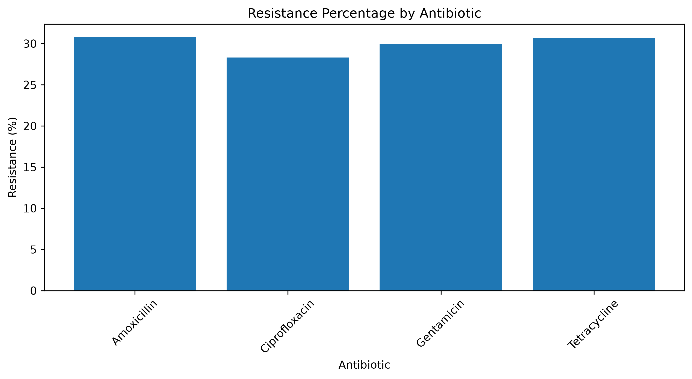
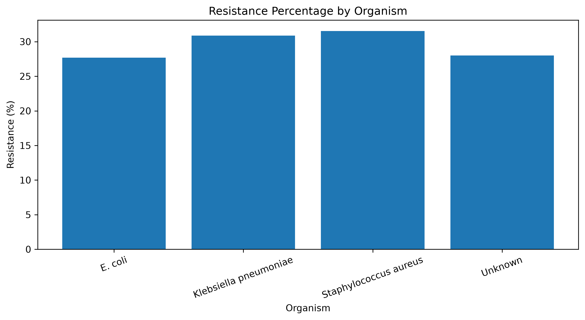
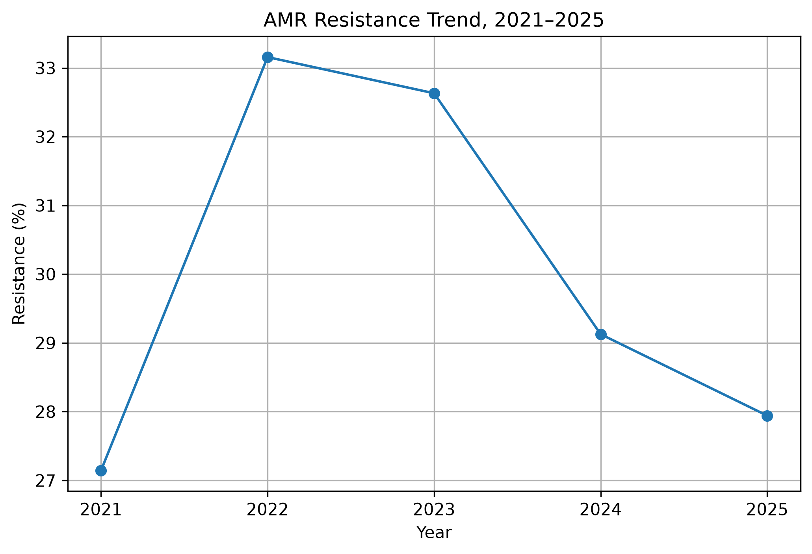
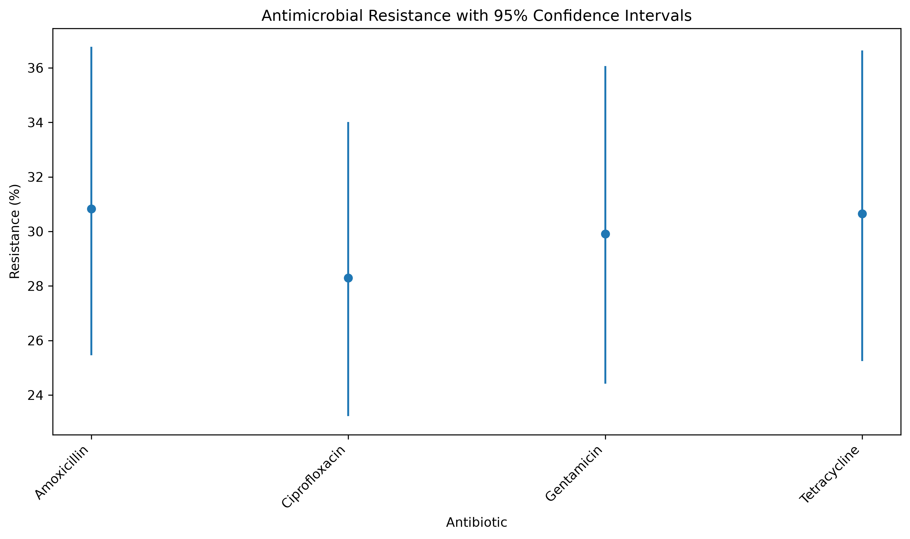
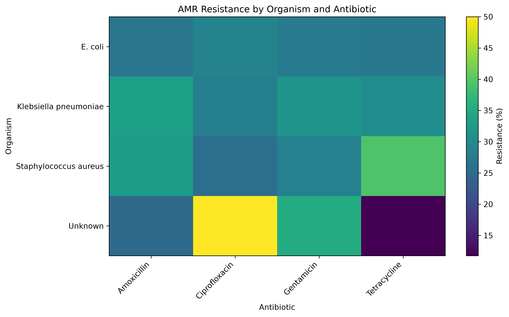

# AMR under One Health
## Project Overview

This project demonstrates an end-to-end Antimicrobial Resistance (AMR) data analysis workflow using Python within a One Health framework. The project was developed to demonstrate practical skills in data cleaning, data validation, exploratory data analysis, statistical analysis, visualization, and reproducible data workflows. A deliberately messy AMR dataset was created to simulate common data-quality problems that can occur in real-world datasets. The dataset was then systematically cleaned, validated, analyzed, and visualized using Python.Project Objectives

The main objectives of this project are to:
- Identify and handle missing values.
- Detect and remove duplicate records.
- Standardize inconsistent text data.
- Identify invalid and unrealistic numeric values.
- Correct inappropriate data types.
- Validate categorical variables.
- Explore antimicrobial resistance patterns.
- Calculate resistance proportions.
- Perform statistical tests.
- Calculate confidence intervals.
- Create informative visualizations.
## Data Cleaning

The dataset contains several simulated data-quality problems, including missing values, inconsistent text formatting, invalid numeric values, incorrect data types, and duplicate records.

## The project addresses:

-Missing values
-Duplicate records
-Inconsistent text formatting
-Invalid age values
-Invalid inhibition-zone measurements
-Incorrect data types
-Categorical data inconsistencies
-Analysis

## The cleaned dataset was used to examine AMR patterns across:
-Antibiotics
-Organisms
-States
-Sources
-Age and inhibition-zone measurements
-Statistical analysis includes:
-Descriptive statistics
-Resistance proportions
-Confidence intervals
-Chi-square testing
-Statistical modeling
-Visualization

## Tools Used
1. Python
2. Pandas
3. NumPy
4. Matplotlib
5. SciPy
6. Statsmodels
7. Jupyter Notebook
8. Workflow
9. Messy Data → Cleaning → Validation → EDA → Statistical Analysis → Visualization → Results
## Skills Demonstrated
This project demonstrates practical skills in Python, Pandas, data cleaning, data validation, exploratory data analysis, statistical analysis, data visualization, and reproducible workflows.

## Disclaimer
This dataset was created for educational and portfolio purposes. It does not represent real-world AMR surveillance data and should not be used for clinical or public-health decision-making.

## Data Outputs

- [Messy AMR Dataset](Messy AMR Dataset.csv).
- [Cleaned Dataset](clean_AMR_data.csv)
- [AMR Resistance by Antibiotic](AMR_resistance_by_antibiotic.csv)
- [AMR Resistance by Organism](AMR_resistance_by_organism.csv)
- [AMR Resistance by Year](AMR_resistance_by_year.csv)

  ## Results and Visualizations

### AMR Resistance by Antibiotic

### AMR Resistance by Organism

### AMR Resistance by Year

### AMR Resistance with 95% Confidence Intervals

### AMR_resistance_heatmap

